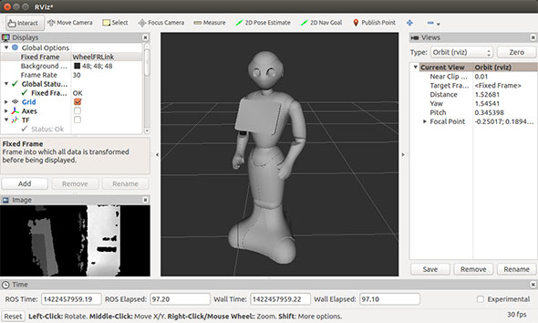

# Pepper Robot Navigation using local path planner as plugin in ROS simulated with Gazebo in the context of Eldery Care

## pre-requisites
- Python 2 
- Gazebo (comes pre-installed with ros-desktop-full)
- [Pepper Robot simulation package](https://github.com/ros-naoqi/pepper_virtual.git)

## Installation
```
cd ~/catkin_ws/src
git clone https://github.com/enansakib/obstacle-avoidance-turtlebot.git
cd ~/catkin_ws
catkin_make
```
NOTE: pepper_meshes needs to be manually installed; apt, rosdep or any package management tools does not handle the dependency to it. See a relevant discussion.
```
sudo apt-get install ros-indigo-pepper-description ros-indigo-pepper-meshes ros-indigo-pepper-control
```
Other plugins to fetch and compile:
```
git clone https://github.com/roboticsgroup/roboticsgroup_gazebo_plugins.git
git clone https://github.com/pal-robotics/pal_msgs.git
git clone https://github.com/pal-robotics/pal_gazebo_plugins.git
catkin_make
```
Please also make sure that the package and all the dependencies are up to date
```
sudo apt-get update
sudo apt-get install ros-indigo-pepper-gazebo-plugin
```

## How to run it
```
roslaunch pepper_gazebo_plugin pepper_gazebo_plugin_Y20.launch
```
This will spawn gazebo with Pepper on a robocup field. The ball has the same specs as the official RoboCup ball (size and mass).

The simulation will be in pause mode to allow initialization of all the controllers. Wait until eveything is successfully loaded:
```
roslaunch pepper_gazebo_plugin path_planer_navigation.launch
```
Click the Play button.
Your Pepper should be standing in front of the ball at the center of the field.

## Demo



## Reference
1. http://wiki.ros.org/ROS/Tutorials
2. https://github.com/ROBOTIS-GIT/turtlebot3_simulations.git


